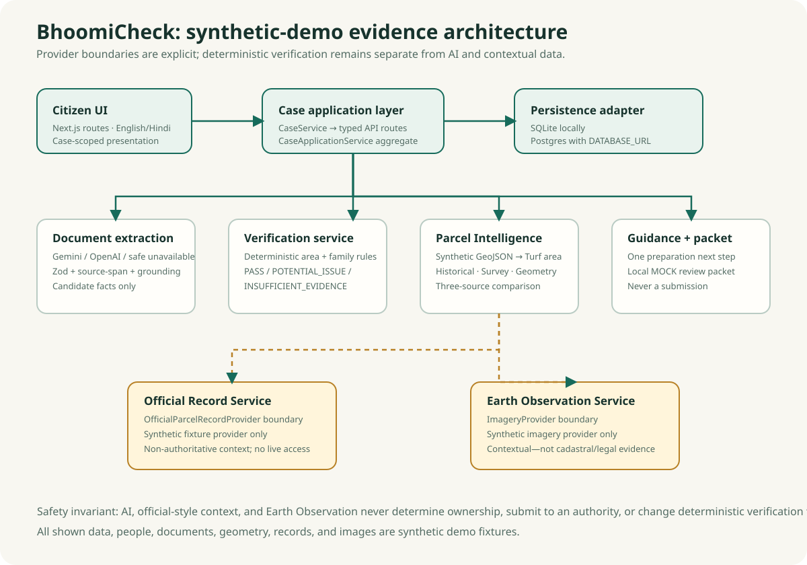

# BhoomiCheck

**Understand your land record before you act.**

BhoomiCheck is a synthetic-first land-survey readiness assistant. It turns fragmented demo records into traceable evidence, deterministic verification, parcel intelligence, and practical next-step guidance—without presenting itself as a government service or making legal decisions.

> **Independent prototype · Synthetic demo data only · Not legal advice or a government portal**

## Demo

Open the verified public demo at [bhoomi-check.vercel.app](https://bhoomi-check.vercel.app). For local development, run `npm run dev` and open [http://localhost:3000](http://localhost:3000).

Start with [`demo-family-001`](http://localhost:3000/cases/demo-family-001), the guided hero case. The recommended flow is:

```text
Dashboard → Documents → Verification → Parcel Intelligence
→ Official Records → Earth Observation → Next Action
```

## The problem

Land-survey preparation can require a citizen to reconstruct one case from historical and current records, family or inheritance context, survey/Parcha information, parcel geometry, and supporting documents. The difficult question is often not where a form lives—it is what evidence exists, what agrees, what needs review, and what to prepare next.

BhoomiCheck does not attempt to replace the land-record system. It provides a citizen-side, synthetic demonstration of an evidence workflow that makes those questions easier to inspect.

## The solution

```text
CASE
  ↓
DOCUMENTS
  ↓
STRUCTURED EXTRACTION
  ↓
DETERMINISTIC VERIFICATION
  ↓
PARCEL INTELLIGENCE
  ↓
CONTEXTUAL RECORD / EARTH OBSERVATION
  ↓
GUIDED NEXT ACTION
```

AI-assisted extraction may suggest structured facts from synthetic text. Deterministic code—not an LLM—compares identifiers and numerical facts, retains evidence references, and returns `PASS`, `POTENTIAL_ISSUE`, or `INSUFFICIENT_EVIDENCE`.

## Judge Quick Start

### Hero case: `demo-family-001`

| Field | Synthetic value |
| --- | --- |
| District | Demo District |
| Circle | Demo Circle |
| Mauza | Example Mauza A |
| Khata | `DEMO-128` |
| Khesra | `DEMO-456` |
| Historical/document area | 1.20 acre |
| Survey/Parcha area | 1.02 acre |
| Mapped geometry area | approximately 1.0243 acre |

Expected story: the historical area differs materially from both the survey and the mapped synthetic boundary, while survey and geometry closely align. This is an evidence comparison—not a statement that any record is legally correct.

### Control case: `demo-family-002`

Open [`/cases/demo-family-002`](http://localhost:3000/cases/demo-family-002) to show the aligned control: `DEMO-902 / DEMO-114` has historical and survey areas of 1.25 acre and mapped synthetic geometry of approximately 1.2514 acre. All three parcel comparisons are consistent; area verification passes and family context correctly reports insufficient evidence rather than inventing a discrepancy.

## Hero result: three traceable area perspectives

| Comparison | Difference | Deterministic result |
| --- | ---: | --- |
| Historical ↔ Survey | 15.0000% | `POTENTIAL_ISSUE` |
| Historical ↔ Geometry | approximately 14.6449% | `POTENTIAL_ISSUE` |
| Survey ↔ Geometry | approximately 0.4160% | `CONSISTENT` |

In plain language: the historical synthetic record differs from both the survey and mapped boundary; the survey and mapped geometry are closely aligned. BhoomiCheck never converts that pattern into an ownership, title, inheritance, or legal conclusion.

## Key capabilities

- Reconstruct a synthetic case around documents, family context, parcels, and a synthetic Khanapuri Parcha.
- Organize evidence and inspect source text, extraction status, and traceability.
- Use optional Gemini or OpenAI extraction behind shared schema, evidence-span, and semantic-grounding checks.
- Run deterministic area and family-context verification with explicit insufficient-evidence outcomes.
- Compare historical, survey/Parcha, and mapped-geometry areas through Parcel Intelligence.
- Inspect synthetic official-style records through a provider boundary, without live government access.
- View two-date synthetic Earth Observation context that is explicitly non-cadastral and non-legal.
- Prepare a local MOCK review packet and receive one practical next step.
- Use the interface in English or Hindi.

## Why BhoomiCheck is different

1. **Evidence-first, not chatbot-first.** Records and their sources lead the journey.
2. **AI extracts; deterministic rules verify.** An LLM cannot decide a discrepancy or legal outcome.
3. **Three independent parcel-area perspectives.** Historical/document, survey/Parcha, and mapped geometry are compared transparently.
4. **Traceability is preserved.** Evidence, provider metadata, provenance, and source references are inspectable without overwhelming the citizen view.
5. **Provider boundaries are honest.** Official-record and imagery boundaries demonstrate future integration patterns without claiming live access.
6. **Context stays context.** Official-style records and Earth Observation do not become additional area sources or modify verification truth.
7. **Missing facts stay uncertain.** `INSUFFICIENT_EVIDENCE` is preferred to fabricated certainty.
8. **Synthetic-first by design.** The complete demo is safe to run without real land records or credentials.

## Architecture



- Route-driven UI resolves a selected `CaseDetail` through `CaseService` and case-scoped API routes.
- `CaseApplicationService` assembles the persisted aggregate; UI components do not read databases or fixtures directly.
- SQLite is used locally; a server-side Postgres adapter is selected with `DATABASE_URL` for the hosted demo configuration.
- Extraction uses an explicit provider selection: Gemini, OpenAI, or a safe unavailable state. Candidate facts must pass Zod/schema, evidence-span, and semantic-grounding checks.
- `VerificationService` is deterministic and source-backed. It does not use an LLM to decide results.
- Parcel Intelligence validates synthetic GeoJSON, calculates area with Turf, and compares exactly three evidence sources.
- Official Record and Earth Observation services sit behind synthetic provider boundaries; neither changes verification or area-comparison truth.
- Guidance and Review Packet services produce preparation artifacts only—never a government submission.

See [architecture notes](docs/ARCHITECTURE.md), [API documentation](docs/API.md), and [data model](docs/DATA_MODEL.md).

## Screenshots

Clean image assets are intentionally not fabricated in this repository. See [the screenshot plan](docs/SCREENSHOT_PLAN.md) for six exact routes, viewport sizes, framing notes, and safe capture requirements. Parcel Intelligence is the strongest technical screenshot.

## Synthetic evaluation proof

The checked-in deterministic evaluation suite reports:

| Measure | Result |
| --- | ---: |
| Test files | 41 |
| Tests | 137 |
| Synthetic cases | 12 |
| Verification outcomes | 24 / 24 correct |
| False positives / false negatives | 0 / 0 |
| Insufficient-evidence outcomes | 5 / 5 |

These figures apply only to the repository's synthetic evaluation suite. They are not claims about real land records, legal accuracy, live-model accuracy, or production performance. Run `npm run eval` to reproduce the reported verification result.

## Safety and prototype boundary

- BhoomiCheck is an independent prototype using fictional, synthetic demo data only.
- It is not a Government of Bihar product or portal, does not retrieve live government records, and does not submit anything.
- Synthetic official-style records are non-authoritative context, not legal evidence.
- Earth Observation is synthetic contextual imagery, not cadastral or legal evidence.
- The product does not determine ownership, inheritance rights, title, encroachment, or legal eligibility.
- Review packets are local preparation aids, not claims, objections, or submissions.

Read the full [safety and privacy boundary](docs/SAFETY.md).

## Codex contribution

Codex was used iteratively as an implementation and review agent across the phased build. The repository history records work on the case/service boundaries, extraction providers, deterministic verification, geospatial and parcel comparison, synthetic official-record and Earth Observation providers, persistence adapters, localization/accessibility, regression tests, and final UX QA. It supported the engineering process; the repository itself remains the source of truth for implemented behavior and limitations.

## Tech stack

- Next.js 16, React 19, TypeScript
- Zod for structured validation
- Node SQLite for local persistence; server-side Postgres/Supabase adapter for hosted configuration
- MapLibre and OpenStreetMap raster basemap for synthetic parcel visualization
- Turf area calculation for synthetic GeoJSON
- Optional Gemini or OpenAI extraction providers
- Vitest and ESLint for regression checks
- Vercel-compatible Next.js deployment configuration

## Local setup and deployment notes

### Prerequisites

- Node.js compatible with the checked-in Next.js configuration
- npm

### Install and run

```bash
npm install
npm run dev
```

Open `http://localhost:3000`. Local mode selects SQLite automatically when `DATABASE_URL` is unset. No AI key is required for case creation, the demo cases, document fixtures, deterministic verification, Parcel Intelligence, Earth Observation, tests, evaluation, or build.

### Optional extraction provider

Copy from `.env.example`; never commit credentials. Choose exactly one provider explicitly:

```bash
AI_EXTRACTION_PROVIDER=gemini
GEMINI_API_KEY=server-only-key
GEMINI_EXTRACTION_MODEL=gemini-2.5-flash
```

or:

```bash
AI_EXTRACTION_PROVIDER=openai
OPENAI_API_KEY=server-only-key
OPENAI_EXTRACTION_MODEL=gpt-4.1-mini
```

Without a selected/configured provider, extraction returns a safe unavailable state. It does not block the deterministic demo flow and does not automatically fall back to another provider.

### Checks

```bash
npm run typecheck
npm run lint
npm test -- --run
npm run eval
npm run build
```

### Hosted demo configuration

Hosted Vercel requests require server-side `DATABASE_URL` to select Postgres; Vercel without it fails safely rather than falling back to local SQLite. Run [`supabase/schema.sql`](supabase/schema.sql) in the configured Supabase project. This remains a synthetic demo—not a shared real-data system—and has no authentication, tenancy, or government integration. See [deployment notes](docs/DEPLOYMENT.md).

## Future scope

Future work—not present in this prototype—could include lawful, documented government-record adapters; licensed/open Earth Observation providers; stronger OCR pipelines; human review workflows; expanded Bihar document schemas; auditable rule packs; and broader regional localization. Any real-data use would first require authentication, authorization, tenancy, privacy controls, retention policies, and a renewed safety review.

## Submission materials

- [2–3 minute and 30-second demo scripts](docs/DEMO_SCRIPT.md)
- [Hackathon submission copy](docs/SUBMISSION_COPY.md)
- [Screenshot capture plan](docs/SCREENSHOT_PLAN.md)
