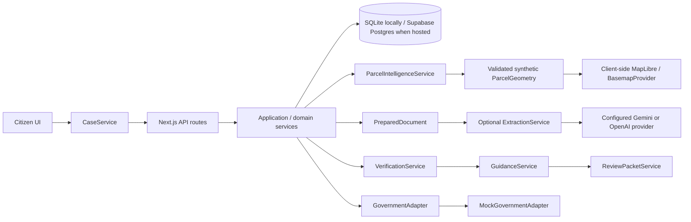
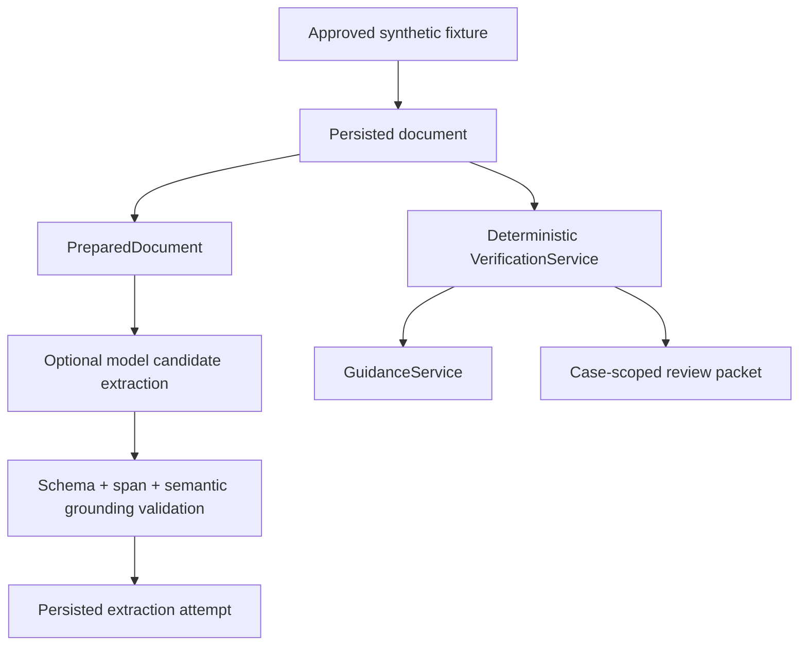

# BhoomiCheck architecture

## Implemented prototype flow

The selected route is the case identity. UI components consume `CaseDetail`; they do not read SQLite, Postgres, or fixture files directly. The client `CaseService` calls typed case-scoped API routes. `PROTOTYPE_MODE = "synthetic-demo"` constrains new synthetic case inputs and approved fixture selection before persistence. Application services assemble persisted synthetic rows, deterministic verification, derived guidance, packets, and honest timeline state into the response.

## Document and verification flow

Extraction is optional and can suggest only grounded candidate facts. `VerificationService` does not use an LLM: it strictly parses supported acreage and compares an explicit family comparison subject with the survey holder. It persists `PASS`, `POTENTIAL_ISSUE`, or `INSUFFICIENT_EVIDENCE` with source-document references.

## Government boundary

`GovernmentAdapter` is server-only. The sole implementation is `MockGovernmentAdapter`, which derives synthetic process context locally and makes no network request. No official adapter, scraping, credentials, OTP flow, or submission path exists.

## Geospatial boundary

`SyntheticParcelGeometryProvider` is represented by deterministic seed geometry persisted as `parcel_geometries`. `GeospatialService` validates GeoJSON and calculates area independently from imagery. A future authorized boundary is `GovernmentAdapter → CadastralParcelProvider → ParcelGeometry`; it is not implemented. `BasemapProvider` and future `ImageryProvider` affect visualization/context only and do not determine parcel geometry or discrepancies.

## Evaluation and observability

The 12-case evaluation constructs synthetic document inputs and invokes the production `VerificationService`. Ground truth is declared independently; calculated metrics include correct/incorrect outcomes, FP/FN, and insufficient-evidence classification counts. Metrics are process-local and privacy-minimized; they are not production monitoring.

## Current limits

Implemented: Next.js UI/API, local SQLite persistence, bundled synthetic fixture attachment, optional server-side extraction, deterministic verification, bilingual presentation, guidance, local review packets, and a mock government boundary.

Mocked: all government workflow context and every document/person/parcel fixture.

Future, not implemented: authentication/session tenancy, managed relational storage, object storage, queues/workers, production observability, migrations/backups, live government integration, and government submission. A real-data deployment must add an authenticated principal followed by authorization/case-ownership validation before exposing persistence. The lack of that boundary means this prototype must not be deployed as a shared case system.
# Parcel area comparison boundary

`ParcelIntelligenceService` derives a typed three-source area model from existing synthetic documents, survey text, and persisted geometry. `ParcelAreaComparisonService` normalizes supported units, applies the symmetric demo policy, and returns pairwise comparisons plus a deterministic summary. No comparison state is persisted and no UI component decides a status. This path is AI-independent and intentionally separate from deterministic verification rules.
