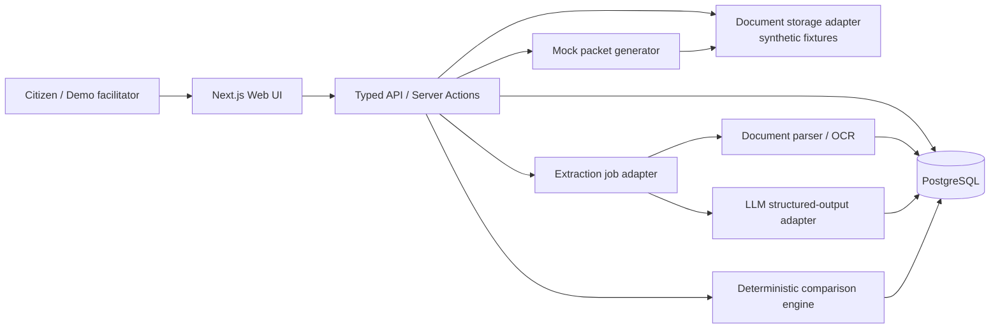
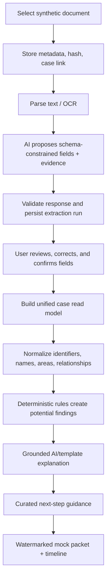
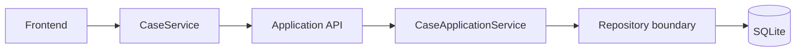

# BhoomiCheck Architecture

## Recommended stack

| Layer | Choice | Why |
| --- | --- | --- |
| Web application | Next.js (App Router) + TypeScript | One typed full-stack codebase, fast demo delivery, server rendering and route handlers |
| UI | Tailwind CSS, shadcn/ui, React Hook Form, Zod | Accessible primitives, fast consistent implementation, typed forms/validation |
| Database | PostgreSQL + Prisma ORM | Relational integrity for provenance-heavy cases and ergonomic migrations |
| Auth | Demo persona/session only for MVP; Auth.js if accounts are added | Avoids collecting real identity data while keeping a replaceable boundary |
| File storage | Local fixture storage for development; S3-compatible private object storage abstraction | Synthetic document fixtures now; safe future replacement without UI changes |
| Background work | In-process job adapter for MVP; BullMQ + Redis-compatible queue when deployed | Document extraction must not block requests; adapter prevents premature infrastructure |
| Document handling | PDF.js/text extraction, OCR adapter (Tesseract or managed OCR), `pdf-lib`/React PDF export | Deterministic parsing and mock-packet generation |
| AI | Provider-agnostic server-side LLM adapter with structured output (Zod/JSON Schema) | Enables extraction and explanations without coupling domain logic to one vendor |
| Observability | Structured logs + Sentry-compatible error adapter; no document contents in logs | Demo diagnostics without sensitive content leakage |
| Testing | Vitest, Testing Library, Playwright, MSW, Prisma test database | Fast rule tests plus full critical-journey coverage |
| Delivery | Docker, GitHub Actions, managed Postgres/object store | Repeatable setup and a credible deploy path |

Pin versions in the eventual `package.json` after project initialization; do not rely on floating versions. The MVP should remain functional in “demo mode” with no external AI, queue, or storage credentials.

## System design



The web layer is intentionally thin. Domain services own case assembly, provenance, comparison, action guidance, and export generation. Route handlers authenticate/validate inputs, invoke services, and return typed DTOs; they must not embed comparison rules or LLM prompts.

## Core domain modules

- **Case service:** creates cases, maintains stages and timeline events, and produces the unified read model.
- **Evidence service:** stores fixture metadata, parsed text, extraction runs, field evidence, and review decisions.
- **Family/parcel service:** manages stated people, relationships, parcels, and identifiers without asserting legal facts.
- **Normalization service:** canonicalizes whitespace, Hindi/Latin transliterations where configured, units, dates, and identifiers. It preserves original text.
- **Comparison engine:** deterministic rule registry evaluates reviewed data and survey-record facts into versioned findings.
- **Explanation service:** generates grounded, plain-language text only from the finding payload and its cited evidence. Template fallback is mandatory.
- **Guidance service:** maps finding categories and survey stage to curated administrative-information cards. It never tells a user what legal right they have.
- **Packet service:** creates a traceable mock review/claim/objection packet from confirmed data and selected findings.

## Data flow



## Database model

Use UUID primary keys, UTC timestamps, soft deletion only where necessary, and `created_at`/`updated_at` on mutable tables. Store source values and normalized values separately. A JSON column is suitable for flexible extraction payloads, never for relationships that need constraints/querying.

| Table | Key fields / relationships | Purpose |
| --- | --- | --- |
| `users` | `id`, `display_name`, `role` | Demo identity boundary; no government identity fields |
| `cases` | `id`, `created_by`, `title`, `status`, `locale`, `survey_stage` | Top-level synthetic case |
| `case_timeline_events` | `case_id`, `event_type`, `occurred_on`, `description`, `source_document_id` | Case history and stage display |
| `people` | `case_id`, `display_name`, `normalized_name`, `is_synthetic` | People mentioned by the case, not legal owners |
| `family_relationships` | `case_id`, `person_a_id`, `person_b_id`, `relationship_type`, `assertion_status`, `source_field_id` | Stated family relationships with provenance |
| `parcels` | `case_id`, `label`, `village_label`, `district_label`, `area_value`, `area_unit`, `normalized_area_sqm` | Synthetic parcel facts |
| `parcel_identifiers` | `parcel_id`, `identifier_type`, `raw_value`, `normalized_value`, `source_field_id` | Khata, Khesra, plot and internal demo IDs |
| `documents` | `case_id`, `kind`, `storage_key`, `sha256`, `page_count`, `is_synthetic` | Fixture/document metadata |
| `document_pages` | `document_id`, `page_number`, `extracted_text` | Parsed page content, protected from logs |
| `extraction_runs` | `document_id`, `pipeline_version`, `provider`, `status`, `raw_response_json` | Reproducible extraction processing |
| `extracted_fields` | `run_id`, `schema_key`, `raw_value`, `normalized_value`, `confidence`, `evidence_json`, `needs_review` | AI/parser suggestions and citations |
| `reviewed_facts` | `case_id`, `fact_type`, `subject_type`, `subject_id`, `value_json`, `review_status`, `source_extracted_field_id` | User-confirmed case facts; preserves lineage |
| `survey_records` | `case_id`, `document_id`, `record_label`, `survey_stage` | Synthetic Khanapuri Parcha/survey record header |
| `survey_record_entries` | `survey_record_id`, `parcel_id?`, `raw_payload_json`, `normalized_payload_json` | Survey side of comparison |
| `comparison_runs` | `case_id`, `rule_set_version`, `input_snapshot_hash`, `status` | Repeatable comparison audit |
| `findings` | `run_id`, `rule_code`, `severity`, `status`, `subject_ref`, `summary`, `evidence_json` | Potential inconsistencies, never legal decisions |
| `finding_explanations` | `finding_id`, `language`, `body`, `generator`, `prompt_version`, `review_state` | Grounded AI/template explanation |
| `guidance_cards` | `finding_id?`, `case_id`, `guidance_code`, `body`, `disclaimer` | Curated informational next actions |
| `packets` | `case_id`, `packet_type`, `storage_key`, `input_snapshot_hash`, `watermark_version` | Generated mock artifacts |
| `audit_events` | `case_id`, `actor_id`, `event_type`, `entity_type`, `entity_id`, `metadata_json` | Traceability for edits, reviews, and exports |

Recommended Prisma enums include `DocumentKind`, `SurveyStage`, `RelationshipType`, `ReviewStatus`, `FindingSeverity`, `FindingStatus`, `PacketType`, and `ExtractionStatus`.

## API routes

All routes live beneath `/api/v1`, return JSON `{ data, error?, meta? }`, validate with Zod, and enforce synthetic-only checks. The UI can call server actions internally, but these endpoints remain the integration contract.

| Method | Route | Responsibility |
| --- | --- | --- |
| `POST` | `/cases` | Create a synthetic case |
| `GET` | `/cases` | List current demo user’s cases |
| `GET/PATCH` | `/cases/:caseId` | Read/update case metadata and stage |
| `POST/GET` | `/cases/:caseId/timeline` | Add/list timeline events |
| `POST/GET` | `/cases/:caseId/people` | Add/list stated people |
| `POST/GET` | `/cases/:caseId/relationships` | Add/list stated relationships |
| `POST/GET` | `/cases/:caseId/parcels` | Add/list parcels and identifiers |
| `POST` | `/cases/:caseId/documents` | Register an allowed synthetic fixture/upload |
| `GET` | `/cases/:caseId/documents/:documentId` | Document metadata and signed view URL |
| `POST` | `/documents/:documentId/extractions` | Queue/retry extraction |
| `GET` | `/documents/:documentId/extractions/latest` | Retrieve validated suggested fields |
| `PATCH` | `/extracted-fields/:fieldId/review` | Confirm, correct, or reject a field |
| `GET` | `/cases/:caseId/unified-record` | Provenance-rich case read model |
| `POST` | `/cases/:caseId/comparisons` | Run deterministic comparison rules |
| `GET` | `/cases/:caseId/findings` | List findings, evidence, explanations, guidance |
| `PATCH` | `/findings/:findingId` | Mark a finding reviewed/dismissed with note |
| `POST/GET` | `/cases/:caseId/survey-records` | Create/list synthetic survey records |
| `GET` | `/cases/:caseId/guidance` | Curated next-step information |
| `POST` | `/cases/:caseId/packets` | Generate mock packet |
| `GET` | `/packets/:packetId` | Packet metadata and download URL |
| `POST` | `/demo/reset` | Reset the authenticated demo workspace to seed data |

## AI pipeline

1. Validate that the document is synthetic and choose a known document schema (legacy record, genealogy, survey record, map metadata, or other demo fixture).
2. Extract embedded text first; run OCR only when required.
3. Send only relevant synthetic page text/images to the server-side LLM adapter with a per-document JSON Schema.
4. Require values, confidence, source citations, and uncertainty. Validate the response with Zod; reject invalid payloads.
5. Canonicalize values with deterministic functions while preserving source text.
6. Persist an extraction run, fields, and evidence. Do not automatically promote fields to reviewed facts.
7. On confirmation, run the comparison engine. Rules include exact/normalized identifier mismatch, area tolerance mismatch, name variation, missing expected relationship, and source-date conflict.
8. Generate explanations from the finding’s structured evidence only. Use templates when AI is unavailable; prohibit conclusions about ownership/legal validity.

## Folder structure

```text
bhoomi-check/
  apps/
    web/                         # Next.js application
      app/                       # routes/pages and API handlers
      components/                # UI components by domain
      lib/                       # client-safe helpers
  packages/
    domain/                      # entities, rules, normalizers, DTOs
    db/                          # Prisma schema, migrations, seed data
    ai/                          # provider adapter, schemas, prompts
    document-processing/         # parser, OCR and fixture adapters
    packet/                      # mock PDF/print packet generation
    config/                      # shared lint/TS config
  fixtures/
    documents/                   # clearly labelled synthetic inputs
    cases/                       # case fixture definitions
  docs/
  tests/
    e2e/
    integration/
  docker-compose.yml
  README.md
```

Start as a pnpm workspace only if packages are introduced immediately. A single `apps/web` project with `src/{domain,server,components}` is acceptable for the first phase; preserve the module boundaries above so extraction and rules can be split later without rewrites.

## Implemented UX foundation (phase 0)

The current prototype is a single Next.js application with route-per-screen navigation. `CaseProvider` owns the transient case state, while `CaseService` is an interface implemented by `MockCaseService`. Screens consume the provider and reusable domain components, never fixture JSON directly. This boundary is the future replacement point for typed API calls and caching.

User-visible language is centralized in `src/lib/i18n.ts`, initially with English and Hindi structures. The app is English-first for this phase, but component strings are designed to move into the locale dictionary as the content layer matures. Screens include a landing page, compact case form, dashboard, documents/field inspection, family relationship view, verification, synthetic survey record, next-action guide, and timeline.

The shell uses semantic headings, labelled navigation, a skip link, keyboard-accessible document inspection, focus styles, responsive touch-friendly controls, and visible loading/empty/error components. It uses no government branding and retains a persistent synthetic-prototype/non-legal notice.

## Case-detail route flow (Phase 1.5 remediation)

Case routes use the URL as the resource identity: `Route (/cases/[caseId]) → CaseProvider → CaseService.getCase(caseId) → Synthetic Case Repository → CaseDetail → UI`. The client provider caches state by case ID (`loading`, `ready`, `not-found`, or `error`) but never selects a global “current” case. The route therefore remains the source of truth and an unknown ID gets a dedicated not-found state.

`CaseDetail` is the single UI input for a selected case. It contains `case`, `family`, `landParcels`, `documents`, `surveyRecord`, `verification`, `nextAction`, and `timeline`. Reusable cards receive the relevant data by props; no case-specific family, survey, guidance, or verification facts are stored in screen components. `MockCaseRepository` supplies two visibly synthetic records (`demo-family-001` and `demo-family-002`) and remains behind `CaseService`, so the future client implementation can replace it with an HTTP API without changing route components.

## Synthetic document workflow (Phase 2)

The Documents route lists only `SyntheticDocumentFixture` items from the service. Selecting a fixture attaches a `DocumentItem` to the current `CaseDetail` with `not-started` status. Explicit user action invokes `CaseService.processDocument`, which delegates to `SyntheticDocumentProcessor`; it deterministically reads labelled lines from the fixture text and emits source-labelled extracted fields. `SyntheticOcrAdapter` is a fixture-only text adapter that preserves the future OCR seam without accepting file uploads or calling external services. The UI renders the original synthetic source text and extraction status/fields, while all mutation remains `UI → CaseProvider → CaseService → MockCaseRepository`.

## Persistence foundation



The API-backed `CaseService` now reads and creates cases through `/api/cases`. `CaseApplicationService` aggregates persisted relational rows into `CaseDetail`; route components remain unaware of SQLite and API handlers remain unaware of UI composition.

## Testing strategy

- **Unit (Vitest):** normalizers, identifier/area comparisons, rule registry, guidance mapping, schema validation, watermark assertions.
- **Integration:** Prisma repositories, extraction response validation, provenance persistence, job state transitions, and packet snapshot inputs using a temporary Postgres database.
- **Contract:** API DTO schemas and LLM JSON schemas; record known synthetic model responses.
- **UI (Testing Library):** field-review controls, source citations, disclaimer visibility, accessible keyboard flows, and empty/error states.
- **E2E (Playwright):** seeded case → fixture document → reviewed field → comparison → explanation → mock packet → timeline. Run in AI-stub mode for repeatability.
- **Visual/manual:** inspect the generated mock packet, mobile breakpoint, bilingual labels, and every consequential disclaimer before demo day.

## Technical risks and mitigations

| Risk | Mitigation |
| --- | --- |
| OCR/LLM variability | Known fixtures, schema validation, AI stubs, mandatory review, template fallback |
| Complex local terminology | Small controlled glossary, source term + plain-language explanation, domain-expert review when possible |
| Lineage/parcel ambiguity | Model assertions with provenance and uncertainty; never resolve them into legal truth |
| Scope inflation | One golden scenario, small rule set, fixed document schemas, defer live integrations/maps |
| Unclear export legality | Mock watermark, fictional format, and explicit non-submission language |
| Background-job deployment complexity | Job adapter with synchronous/demo implementation before adding Redis |
| Data leakage | Synthetic-only fixtures, private storage abstraction, redacted logs |
