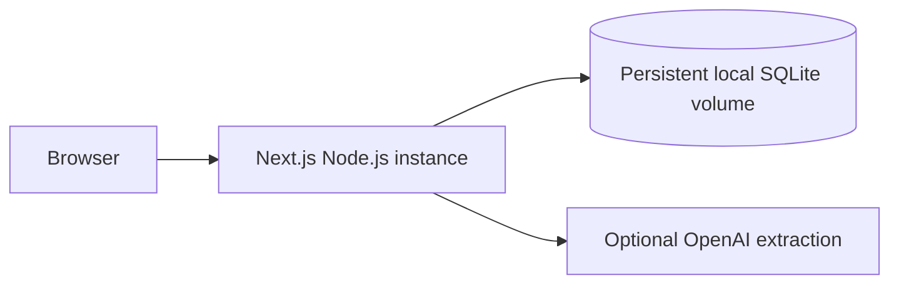

# Controlled synthetic-demo deployment

## Selected architecture

BhoomiCheck is deployable for a controlled hackathon demonstration on one long-lived **Node.js** application instance with a writable persistent volume mounted at `data/`.



Every API route uses the Node runtime because the prototype uses Node's built-in SQLite module. Do not deploy this build to an edge runtime, a serverless platform with an ephemeral/read-only filesystem, or multiple application instances sharing no SQLite coordination.

## Persistence behaviour

`data/bhoomi-check.sqlite` holds synthetic cases, documents, verification snapshots, packets, and timeline events. With a persistent volume, state survives process restarts and deploys that retain that volume. Without one, state may disappear on restart/redeploy; that deployment is not suitable for the judge demo.

The database is ignored by Git. It is not a production database, does not provide multi-instance locking, backup/recovery guarantees, user privacy, or tenant isolation.

## Environment configuration

Required for the deterministic demo: no environment variables.

Optional server-only extraction configuration:

```text
OPENAI_API_KEY=...
OPENAI_EXTRACTION_MODEL=gpt-4.1-mini
```

Without `OPENAI_API_KEY`, optional extraction reports a safe unavailable state. Case creation, fixture attachment, verification, guidance, packet preparation, reset, evaluation, and the hero/control journeys continue without it. Never expose or log the key.

## Synthetic-only boundary

`PROTOTYPE_MODE = "synthetic-demo"` cannot be disabled by deployment configuration. The server accepts only synthetic `DEMO-...` identifiers, clearly labelled synthetic/demo case text, and approved bundled fixtures. It has no arbitrary upload, official integration, credential, OTP, or submission route.

`POST /api/demo/reset` is a visible repeatability aid for the two approved seed cases only: `demo-family-001` and `demo-family-002`. It restores one selected seed case and leaves arbitrarily created synthetic cases untouched. It is not a generic database-delete endpoint.

## Not production-ready

This deployment profile is appropriate only for local development, synthetic evaluation, and a controlled hackathon demo. It is not appropriate for real citizen data, sensitive documents, public multi-user storage, legal/government workflow, or any deployment that requires authentication and authorization.
