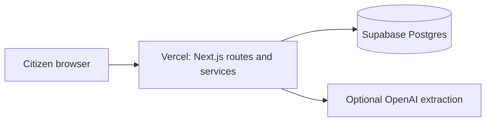

# Hosted synthetic-demo deployment

## Architecture

Local development uses Node SQLite at `data/bhoomi-check.sqlite`. Hosted Vercel deployments use server-side Postgres through `DATABASE_URL`; no browser connects to Supabase and Supabase Auth is not implemented.

## Setup

1. Create a Supabase project and obtain its pooled **server-side Postgres connection string**.
2. In Supabase SQL Editor, run [`supabase/schema.sql`](../supabase/schema.sql).
3. In Vercel, import this GitHub repository and set `DATABASE_URL` to that sensitive connection string for Production and Preview as required.
4. Optionally set `OPENAI_API_KEY` and `OPENAI_EXTRACTION_MODEL`; extraction is optional.
5. Deploy, then open `/api/health` and expect `status: ok`.
6. Verify `/cases/demo-family-001`, `/cases/demo-family-002`, a newly created synthetic case, fixture attachment, refresh persistence, review-packet preparation, demo reset, English/Hindi, and mobile layout.

Vercel without `DATABASE_URL` returns safe unavailable persistence responses rather than using ephemeral local SQLite. Seed records are generated idempotently by the normal service layer. The reset endpoint only recreates one of the two approved synthetic seed cases.

## Safety boundary

This is a synthetic hackathon demo, not a production citizen-data system. It has no authentication, authorization, case ownership, real-data controls, official government integration, or submission capability. Do not expose `DATABASE_URL` or OpenAI credentials to browser code or Git.
