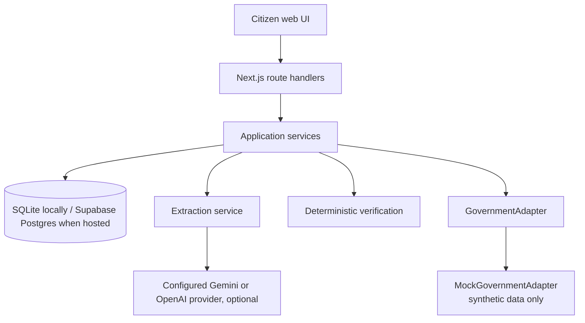
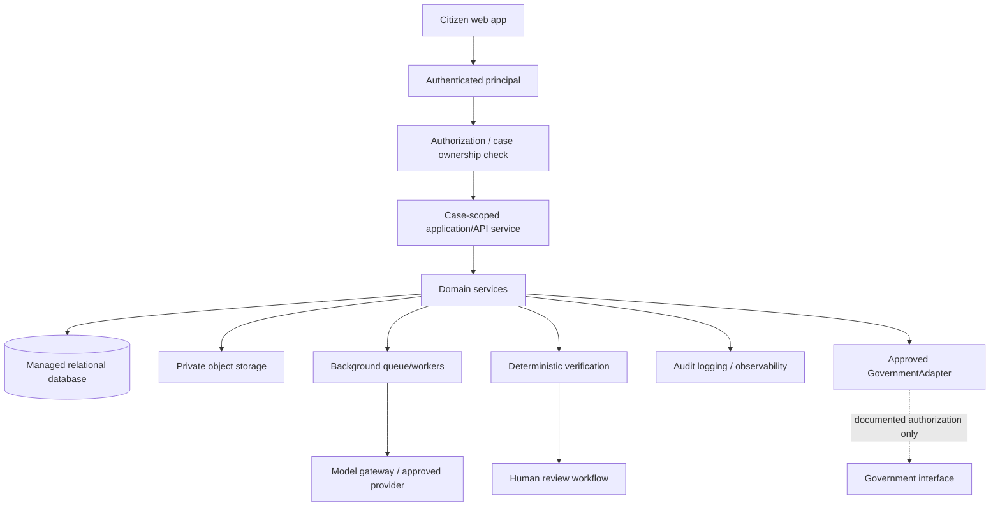

# BhoomiCheck Production Architecture

## Implemented prototype architecture

The current prototype uses a server-side persistence adapter: local development uses SQLite, while the hosted Vercel demo uses Supabase Postgres through a server-only connection string. A packet is a local MOCK preparation record; `READY_FOR_REVIEW` freezes that record and never submits or exports it. Deterministic verification operates over stored synthetic records. Gemini (recommended for the demo) and OpenAI are optional server-side extraction providers using a shared versioned structured-output trust boundary. The only government boundary implemented is `MockGovernmentAdapter`; it is deterministic, performs no network calls, and labels every result as synthetic and non-official.

`GovernmentAdapter` is an interface for future approved integrations. No `OfficialGovernmentAdapter`, portal integration, scraping, reverse engineering, OTP workflow, credential use, or submission behavior exists in this repository.

## Future production architecture — not implemented

Future deployment accepting real citizen information must add an authenticated principal and authorization/case-ownership check before case persistence is exposed. It would use a managed relational database, encrypted object storage with server-generated object keys, and asynchronous workers for document processing. A model gateway would keep provider credentials server-side and log only redacted operational metadata. Human review remains required before consequential action. Audit events would be separate from the citizen timeline and retain operation, case reference, actor/session boundary, timestamp, rule/prompt version, and result IDs without duplicating document contents.

The implemented prototype has only process-local lightweight timing events and a synthetic deterministic evaluation command. Centralized monitoring, alerting, trace retention, dashboards, and model evaluation pipelines are future work.

Future access control, tenant isolation, backups/recovery testing, retention policies, encryption, monitoring, rate limits, and incident response are **not implemented**. Authentication/session/tenant infrastructure (P1-09) remains explicitly deferred. Any government integration must use an approved, documented interface with explicit authority; it must never be inferred from website behavior.

## SQLite and deployment limitation

SQLite is the local development/test adapter only. Hosted Vercel requests use Supabase Postgres through the same server-side adapter boundary; Vercel without a configured database fails safely rather than relying on its filesystem. This synthetic demo remains unsuitable for real-data production: authentication, authorization, case ownership, real-data controls, durable audit logging, and approved government integrations remain future work. See `docs/DEPLOYMENT.md`.

## Upload safety boundary

Current document inputs are bundled synthetic fixtures; no arbitrary user upload route exists. A future upload implementation must enforce allowlisted content types and sizes, sanitize display filenames, generate storage IDs server-side, reject executable content, and never accept a client-controlled filesystem path.
